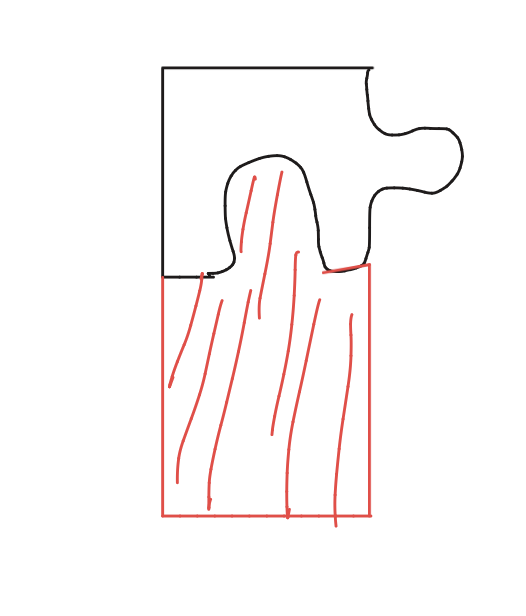
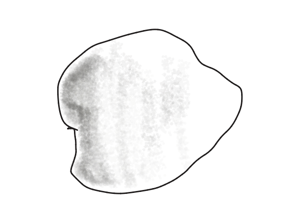

+++
date = '2026-02-08T23:53:52+01:00'
draft = false
title = '2.1 Design a Building Block'
+++
LEGOs are super apt for tinkering as they're pretty modular, easy to assemble and disassemble and give a really fast feedback of the prototype. It is a super low fidelity prototype which acts like a "hair on fire" solution where any solution (including a brick to douse a fire) is considered without any judgements.

A technical hurdle I see with LEGOs are that they are too rigid and tend to generalise certain solutions. It pushes certain features to be evaluated out of scope.

| Feature | Option 1 | Option 2 | Option 3 | Option 4 |
| :--- | :--- | :--- | :--- | :--- |
| **Connection** |   Interference Fits (like in LEGOs) |  Magnetic |   Positive Interlocking |   Adhesion (clay) |
| **Geometry** |   Freeform |   Nodes and Links |   Cubic structures |  |
| **DoF** |  |  |  |  |
| **Assembly** |  |  |  |  |
| **Modularity** |  |  |  |  |

