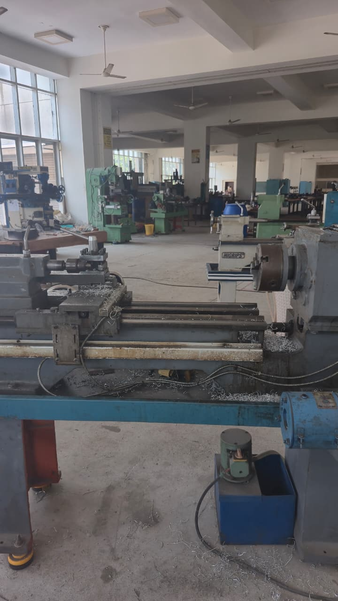
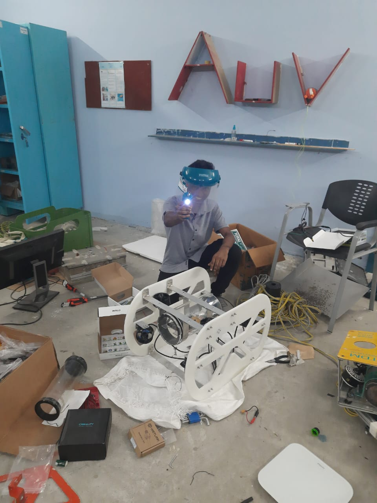
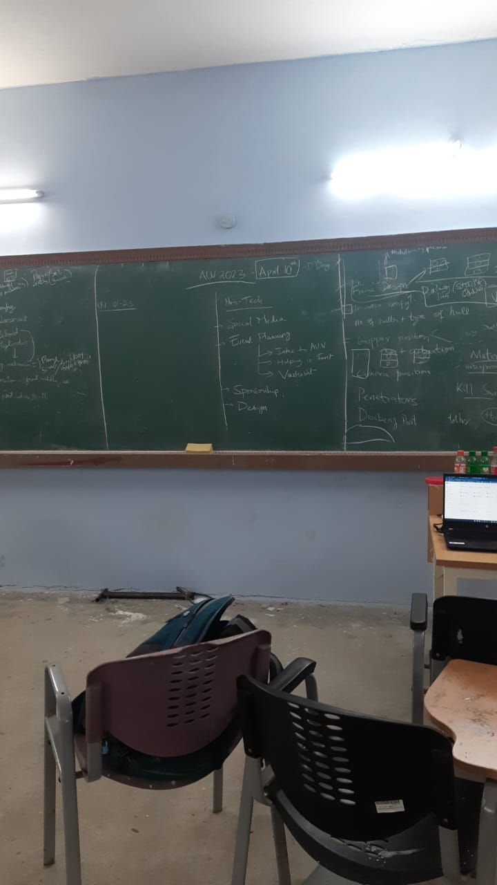

+++
date = '2026-02-09T00:12:24+01:00'
draft = false
title = '1.1 Tinkering Spaces - Photo Safari'
tags = ['spaces','tinkering','photos']
+++

Ideally, a tinkering space is one that provides necessary tools, resources and a comfortable place to work in.

My adventures in the wild:

    

        
    

    

        <h3>A Mechanical Workshop</h3>
        

            The lathe and the milling machine, a standard machining environment. Can get something physical built. The huge room gives birth to gigantic ambitious projects.
        

    

    

        <h3>A Small Scale Professional Workspace</h3>
        

           A very comfortable and professional workspace to spend long hours ideating and iterating. The surrounding cubicles are open and give a chance of interaction with other like-minded people. 
        

    

    

        
    

    

        
    

    

        <h3>A Cycle Repair Shop</h3>
        

            A dedicated workshop to repair cycles. Has every tool to fix a flat, fix a new chain, maybe a new set of rims and so on.
        

    

    

        <h3>A Welder's Workshop</h3>
        

           He welds several 'jobs' a day, usually the same job the every other day, but was well prepared to handle our out of the ordinary weld job. 
        

    

    

        
    

    

        
    

    

        <h3>A Student Association</h3>
        

            The messy room of a student led underwater robotics association, featuring me. Chaotic but still gets the work done.
        

    

    

        <h3>A Student Association contd..</h3>
        

            A huge board where designs and deadlines are posted, ideal for pitching and ideating ideas with many people. 
        

    

    

        
    

